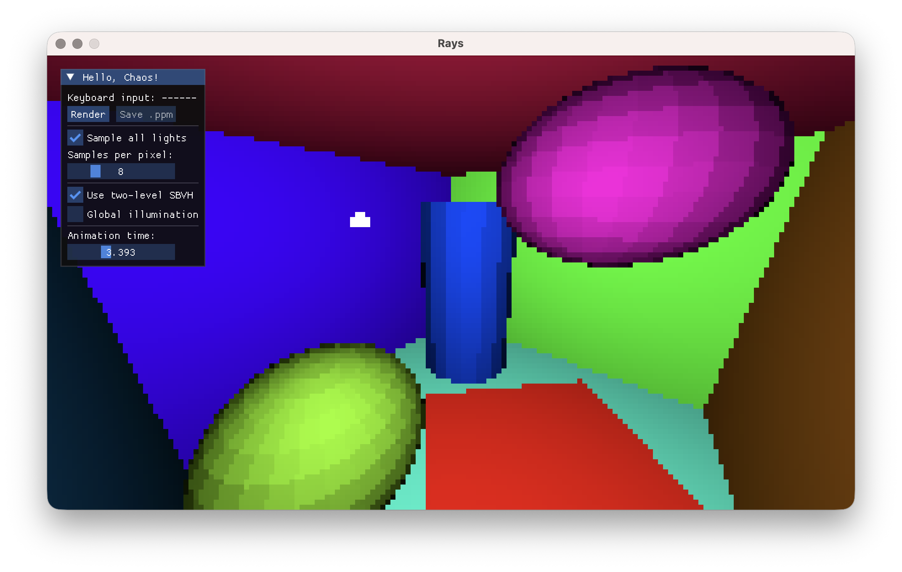
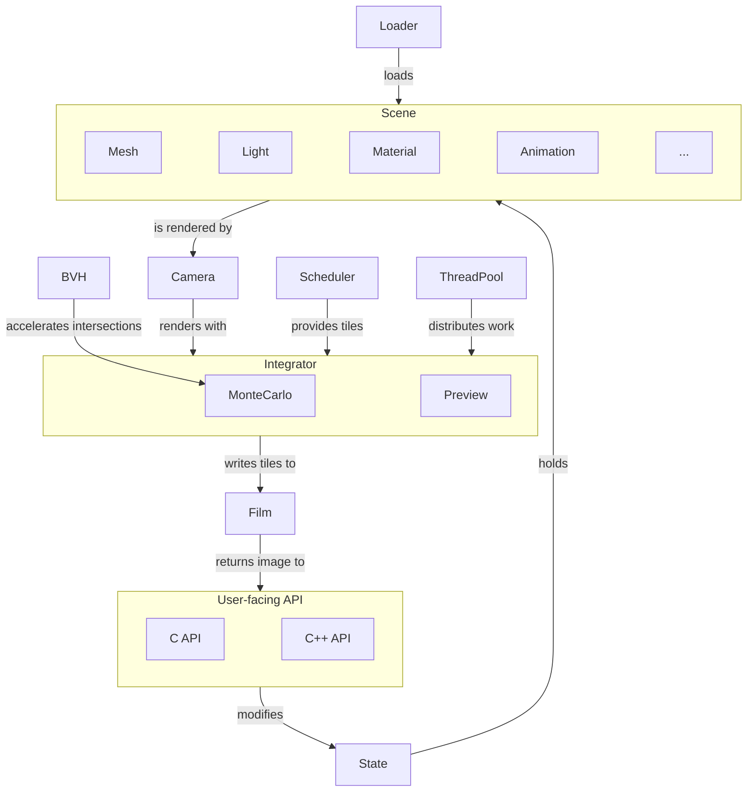

<!-- Rays --------------------------------------------------- Jakub Profota --->

<div align="center">
  <h1><code>——— rays ——▸</code></h1>

Built with ❤️ for [Chaos Camp](https://www.chaos.com/chaos-camp)!
</div>


A small real-time ray tracer written in modern C++26.  Render scenes described
in _.crtscene_ file with global illumination, accelerated by two-level SBVH.
Animate with keyframed cameras, objects, and lights.  Use CLI to produce images
and videos, or use interactive GUI to preview scenes and fly around.

## Build

Clone with all submodules and run from within the repository:

```
cmake -S . -B build
cmake --build build -j 8
```

The code has been tested with _Clang ≥22.0.0_, _CMake ≥4.3.0_, and
_Ninja ≥1.13.0_. If you are a _Nix_ user (including on MacOS), you can enter
a development shell with all the needed dependencies using:

```
nix develop
```

## Run

Run tests:

```
./build/bin/tests
```

Run CLI to compute an _output.ppm_ image in the current working directory:

```
./build/bin/cli assets/13/scene0.crtscene
```

If the specified _.crtscene_ includes animation, CLI will produce a sequence
of images.  You can use _ffmpeg_ to convert images to a video:

```
ffmpeg -framerate 30 -i video/frame_%04d.ppm -c:v libx264 -pix_fmt yuv420p -crf 20 rays.mp4
```

Run GUI to preview a scene and its optional animation in real-time:

```
./build/bin/gui assets/15/scene2.crtscene
```

Fly around the scene with WSADQE and drag with the left mouse button.  Change
settings, such as samples per pixel, in menu window, and render and save image.



## Architecture

- `assets` - _.crtscene_ files.
- `deps` - Dependencies as _Git_ submodules.
- `source`
  - `cli` - CLI utility.
  - `gui` - GUI application.
  - `rays` - Static library with user-facing C and C++ API.
    - `camera` - Handle rendering of a scene to a film.
    - `image` - Convert pixel samples held in camera film to specified image format.
    - `integrator` - Compute radiance along sampled rays.
    - `math` - Custom math types.
    - `object` - Various objects contained in a scene.
    - `render` - Animate using keyframes, accelerate intersections, schedule film tiles.
    - `scene` - Load and hold scene data.
    - `state` - Global state of rendering options and a thread pool.
    - `utility` - Random number generator and trivial type aliases.
- `tests` - A bunch of unit tests.



<!----------------------------------------------------------------------------->
